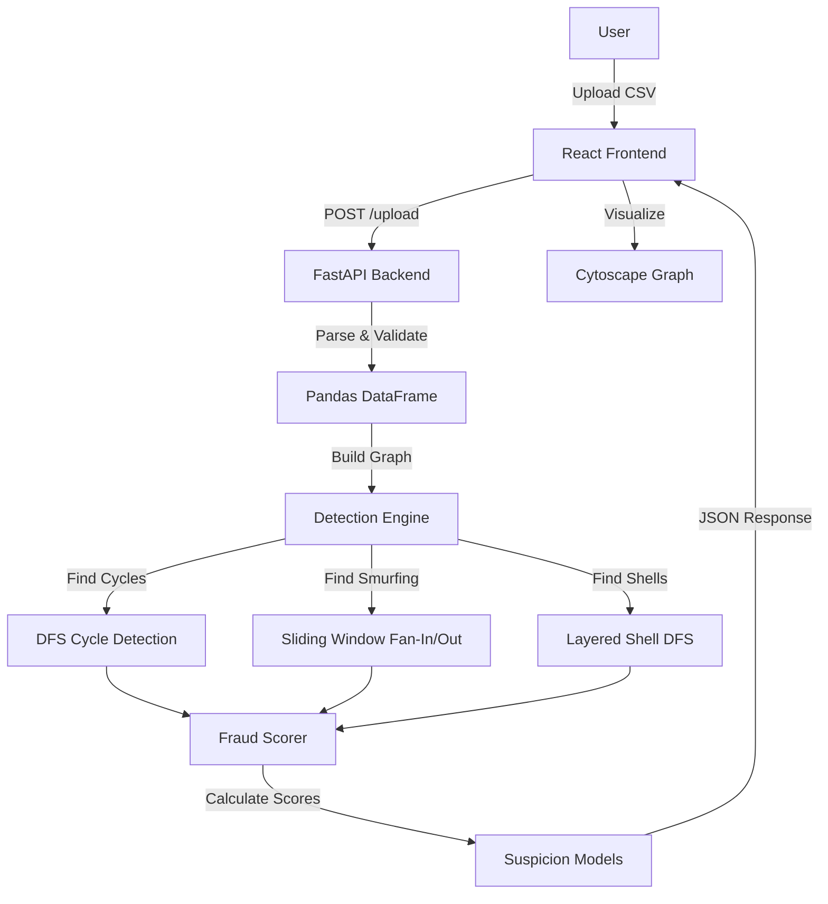

# RIFT 2026 Money Muling Detection System

## 🚀 Live Demo
[Insert Public URL Here]

## 🛠 Tech Stack
- **Backend:** Python, FastAPI, Pandas, NetworkX
- **Frontend:** React, Vite, Tailwind CSS, Cytoscape.js
- **Deployment:** [Instructions below]

## 🏗 System Architecture


## 🧠 Algorithms & Complexity

### 1. Cycle Detection (Length 3-5)
- **Algorithm:** Depth-Limited DFS with canonicalization.
- **Complexity:** O(N * b^d) where d=5. Optimized with pruning and visited sets.

### 2. Smurfing Detection (Fan-In/Out)
- **Algorithm:** Sliding Window (72h) over sorted transactions.
- **Complexity:** O(T) (Linear scan). **Deduplicated** to prevent overlapping events.

### 3. Layered Shell Chains
- **Algorithm:** Filtered DFS searching for paths of length ≥ 3 hops where intermediate nodes have low activity (2-3 txs).
- **Complexity:** O(N) (Heavily pruned by shell criteria).

## 🧮 Suspicion Scoring Methodology
Scores (0-100) are calculating using a weighted sum of normalized features:

`Score = 0.35*Cycle + 0.10*FanIn + 0.10*FanOut + 0.15*Layered + 0.10*Velocity + 0.10*AvgAmount + 0.10*Centrality`

- **Velocity:** Normalized transaction count in 72h window.
- **Avg Amount:** Log-normalized average transaction amount.
- **Centrality:** Degree centrality (Unique Neighbors / N-1).

## 🛡 False Positive Controls
To avoid flagging legitimate merchants or payroll:
1. **Whitelisting:** API `/whitelist/add` to exclude trusted accounts.
2. **Centrality Fix:** Uses unique neighbors to correctly model influence.
3. **Thresholds:** Smurfing requires ≥ 10 unique counterparties in 72h.
4. **Safe Sink Heuristic:** Accounts with High Fan-In (Receiving) but Zero Fan-Out/Cycles are classified as Sinks (Merchants/Savings) rather than Mules, effectively filtering out false positives like `MERCHANT_01`.

## 📦 Install & Usage

### Prerequisites
- Python 3.8+
- Node.js 16+

### Setup
1. **Backend:**
   ```bash
   ./run_backend.sh
   # Server starts at http://localhost:8000
   ```
   *(First run will create venv and install dependencies automatically)*

   Manual setup:
   ```bash
   python -m venv venv
   source venv/bin/activate
   pip install -r requirements.txt
   uvicorn backend.main:app --reload
   ```

2. **Frontend:**
   ```bash
   ./run_frontend.sh
   # App opens at http://localhost:5173
   ```
   *(Ensure you run `npm install` in frontend folder first if script fails)*

### Usage
1. Open the Web UI.
2. Drag & Drop a transaction CSV (Format: `transaction_id,sender_id,receiver_id,amount,timestamp`).
3. View the interactive Graph, Fraud Rings Table, and Suspicious Accounts.
4. Click "Download JSON" to get the exact report format.

## 👥 Team Members
- [Your Name/Team Name]
